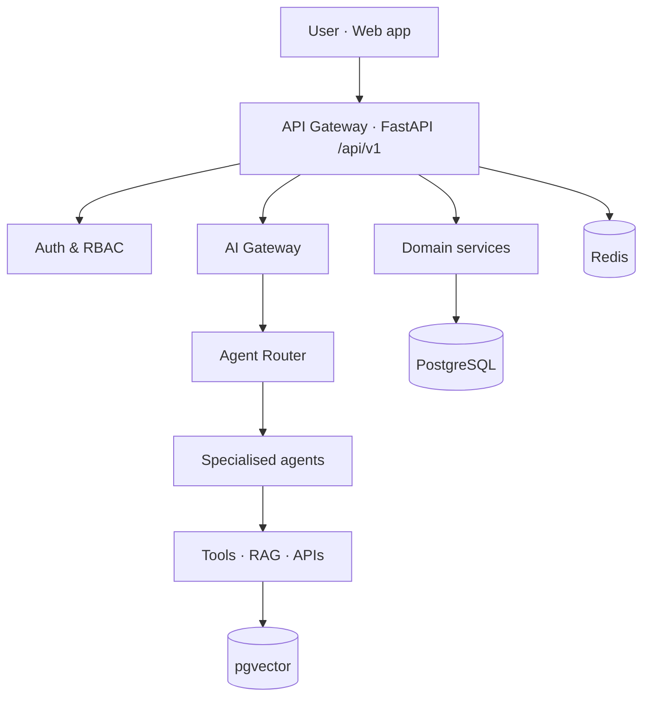
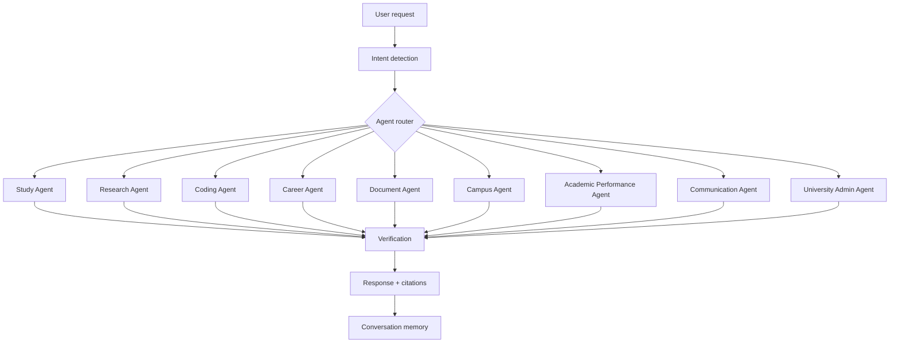
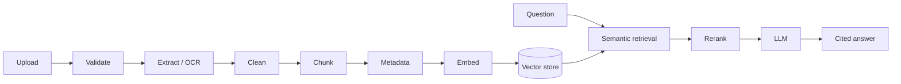

# UniOS AI — AI University Operating System

> **One intelligent system for your entire university life.**

UniOS AI is a modular, production-oriented platform that acts as an intelligent
digital layer for a university: study, research, coding, careers, documents,
campus information and academic workflows, orchestrated by specialised AI agents.

This repository currently contains **Phase 1 — Foundation**:
monorepo layout, Next.js web app (landing page, auth pages, dashboard shell),
FastAPI backend, PostgreSQL + migrations, JWT authentication with roles,
Docker Compose, CI and documentation. Later phases (AI core, RAG, agents,
multimodal, university platform) build on these foundations and are tracked in
the roadmap below.

Nothing in this repository pretends to be an AI feature that is not implemented.
Agent, RAG and model interfaces are documented in `docs/` and will be added in
the phases that own them.

---

## Table of contents

- [Screenshots](#screenshots)
- [Features](#features)
- [Architecture](#architecture)
- [AI agent architecture](#ai-agent-architecture)
- [RAG pipeline](#rag-pipeline)
- [Tech stack](#tech-stack)
- [Project structure](#project-structure)
- [Installation](#installation)
- [Environment variables](#environment-variables)
- [Docker setup](#docker-setup)
- [API documentation](#api-documentation)
- [Database](#database)
- [Security](#security)
- [Testing](#testing)
- [Roadmap](#roadmap)
- [Contributing](#contributing)
- [License](#license)

---

## Screenshots

| Landing | Dashboard |
| --- | --- |
| _`docs/images/landing.png` (placeholder)_ | _`docs/images/dashboard.png` (placeholder)_ |

---

## Features

**Implemented (Phase 1)**

- Landing page with product story and calls to action
- Register / login / logout with JWT access + refresh tokens
- Role model: `STUDENT`, `FACULTY`, `ADMIN`, `CLUB`, `SUPER_ADMIN`
- Role-based access control dependency on the API
- Dashboard shell with today's overview, quick actions and insight slots
- Dark / light mode, responsive layout
- PostgreSQL with Alembic migrations
- Docker Compose for web, api, postgres, redis
- Pytest API tests and GitHub Actions CI

**Implemented (Phase 2 — AI core)**

- Provider-agnostic AI layer: any OpenAI-compatible endpoint (OpenAI, OpenRouter,
  Groq, Together, vLLM, Ollama, LM Studio) selected purely through environment
  variables — no vendor SDK is imported anywhere in the codebase
- Chat API with streamed replies (server-sent events) and full non-streaming mode
- Automatic agent routing across nine specialised agents, returning the chosen
  agent, a confidence score and the signals that produced it
- Conversation history saved per account, private by row-level ownership checks
- Memory composition: agent role + user academic context + recent turns
- Prompt-injection defence baked into every system prompt: retrieved and uploaded
  content is treated as data, never as instructions
- Assistant interface at `/chat` with conversation list, manual agent override
  and an honest "no provider configured" state

**Planned (see roadmap)** — RAG with citations, agent tools, multimodal input,
calendar, notifications, admin dashboard, evaluation framework.

---

## Architecture



## AI agent architecture



## RAG pipeline



---

## Tech stack

| Layer | Choice |
| --- | --- |
| Web | Next.js (App Router), React, TypeScript, Tailwind CSS |
| API | FastAPI, Pydantic v2, SQLAlchemy 2, Alembic |
| Database | PostgreSQL 16 (+ pgvector from Phase 3) |
| Cache / queues | Redis |
| Auth | JWT access + refresh, bcrypt password hashing, RBAC |
| Tooling | Docker Compose, Ruff, Pytest, ESLint, GitHub Actions |

## Project structure

```text
unios-ai/
├── apps/
│   ├── web/          Next.js frontend
│   └── api/          FastAPI backend
├── packages/
│   └── types/        Shared TypeScript contracts
├── services/         Document processing, RAG, orchestrator (later phases)
├── docs/             Architecture, API, agents, RAG, deployment
├── scripts/
├── .env.example
├── docker-compose.yml
└── README.md
```

## Installation

**Prerequisites:** Node.js 20+, Python 3.11+, PostgreSQL 16 (or Docker).

```bash
cp .env.example .env

# API
cd apps/api
python -m venv .venv && source .venv/bin/activate
pip install -e ".[dev]"
alembic upgrade head
uvicorn app.main:app --reload --port 8000

# Web (second terminal)
cd apps/web
npm install
npm run dev
```

Web: http://localhost:3000 · API docs: http://localhost:8000/docs

## Environment variables

All variables are documented in [`.env.example`](.env.example). Secrets are
never committed and never exposed to the frontend; only `NEXT_PUBLIC_*`
variables reach the browser.

## Docker setup

```bash
cp .env.example .env
docker compose up --build
```

Services: `web` (3000), `api` (8000), `postgres` (5432), `redis` (6379).
Migrations run automatically on API start.

## API documentation

Interactive OpenAPI docs are served at `/docs` and `/redoc`. Endpoint reference:
[`docs/api.md`](docs/api.md). All routes are versioned under `/api/v1`.

## Database

Entity design and migration workflow: [`docs/architecture.md`](docs/architecture.md).
Create a migration with:

```bash
cd apps/api && alembic revision --autogenerate -m "feat: add x"
```

## Security

JWT authentication, RBAC, Pydantic input validation, bcrypt hashing,
parameterised queries via SQLAlchemy, CORS allow-list, rate-limit hooks,
audit-log table, and a documented policy that retrieved document content is
treated as untrusted data and never as system instructions.
Details: [`docs/architecture.md`](docs/architecture.md#security).

## Testing

```bash
cd apps/api && pytest        # API, auth and permission tests
cd apps/web && npm run lint  # lint + type-check
```

## Roadmap

- [x] Phase 1 — Foundation: monorepo, auth, dashboard, database, Docker, CI
- [x] Phase 2 — AI core: provider abstraction, chat API, streaming, agent router
- [x] Phase 3 — RAG: ingestion, chunking, embeddings, retrieval, citations
- [x] Phase 4 — Agents: study, research, coding, career, document, campus
- [x] Phase 5 — Multimodal: vision, OCR, speech-to-text, text-to-speech
- [x] Phase 6 — University platform: academics, calendar, events, admin
- [x] Phase 7 — Reliability: evaluation, observability, rate limiting
- [x] Phase 8 — Deployment: production Docker, CI/CD, migrations

## Contributing

Conventional commits (`feat:`, `fix:`, `docs:`, `chore:`), one concern per PR,
lint and tests green before review. See [`docs/deployment.md`](docs/deployment.md)
for environments.

## License

MIT — see [LICENSE](LICENSE).
