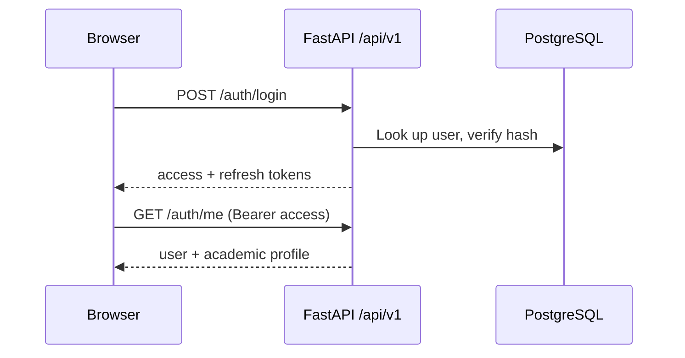

# Architecture

## Overview

UniOS AI is a monorepo with two deployable applications and a set of shared
packages and services.

- `apps/web` — Next.js App Router frontend. Owns presentation, session storage
  in the browser, and calls to the API. It never holds provider API keys.
- `apps/api` — FastAPI backend. Owns authentication, authorisation, the data
  model, and (from Phase 2) the AI gateway and agent orchestration.
- `packages/types` — shared TypeScript contracts mirroring the API schemas.
- `services/` — document processing, RAG and agent orchestration, extracted as
  separate modules so they can later run as their own workers.

## Request flow

## Data model (Phase 1)

| Table | Purpose |
| --- | --- |
| `users` | Identity, credentials, role, activation and verification state |
| `profiles` | Optional academic context: degree, branch, semester, interests |
| `audit_logs` | Security-relevant events: register, login, logout |

Planned entities, added by the phase that uses them: `courses`, `subjects`,
`documents`, `document_chunks`, `conversations`, `messages`, `agents`,
`agent_runs`, `tasks`, `assignments`, `events`, `announcements`, `attendance`,
`grades`, `skills`, `projects`, `resumes`, `research_papers`, `notifications`,
`feedback`.

Every schema change ships as an Alembic migration; no table is created by
application code at runtime.

## Roles and access control

`STUDENT`, `FACULTY`, `ADMIN`, `CLUB`, `SUPER_ADMIN`. Roles are stored on the
user record and checked server-side with the `require_roles` dependency.
Administrative endpoints are never merely hidden in the UI — they return 403
for unauthorised roles, which the test suite asserts.

## Security

- Passwords hashed with bcrypt; identical error text for unknown email and wrong
  password so accounts cannot be enumerated.
- Short-lived JWT access tokens plus longer-lived refresh tokens; the token type
  is part of the payload and validated, so an access token cannot be replayed as
  a refresh token.
- All input validated by Pydantic models with explicit length and range bounds.
- SQLAlchemy parameterised queries only; no string-built SQL.
- CORS restricted to an explicit allow-list from the environment.
- Audit log for authentication events.
- Secrets come from the environment; `.env` is never committed and only
  `NEXT_PUBLIC_*` variables reach the browser.
- Retrieved document content is data, never instruction. From Phase 3, chunk
  text is passed to models inside a delimited, clearly labelled untrusted block
  and system prompts explicitly refuse instructions found in retrieved content.

## Extensibility

- AI providers sit behind interfaces (`ChatModel`, `EmbeddingModel`, `Reranker`,
  `VisionModel`, `SpeechToTextModel`, `TextToSpeechModel`, `ModerationModel`) so
  models are switched through environment variables, not code changes.
- The vector store is accessed through a repository interface; pgvector is the
  default and Qdrant/Weaviate can replace it without touching agent code.
- Branding lives in `apps/web/src/lib/branding.ts` and the API `app_name`
  setting.
